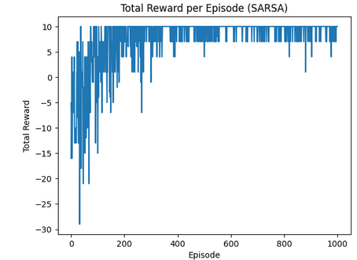
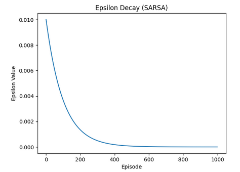

# -Dungeon-Explorer-Reinforcement-Learning-in-a-Grid-based-Adventure

### Journeying Through the Dungeon

In this project, we've dived into the world of reinforcement learning to guide an adventurer through a maze-like dungeon. Picture a grid-based space, a 5x5 map filled with treasures, dragons, keys, and mysterious doors.

#### Setting the Scene

Our protagonist, the player, has a mission: to navigate this adventurous but perilous dungeon. With the ability to move in four directions—Up, Down, Left, and Right—the player's goal is to reach the bottom-right corner of the grid. Along the way, they'll collect treasures, unlock doors, and evade lurking dragons.

#### The Dungeon's Components

**Player State**: This is where your journey begins, marked by your initial position within the grid.

**Enemy Positions**: Dragons occupy specific spots within the grid, a constant threat to be cautious of.

**Rewards and Penalties**: Each action has its consequences. For instance:
- Encountering a dragon comes with a penalty of -10.
- Discovering a treasure rewards +10.
- Successfully unlocking a door yields +5, while attempting without a key incurs a penalty of -5.
- Moving to a new state is rewarded with +1, but staying in the same state results in a small penalty of -2.

#### Visualizing the Adventure

The grid-based environment is visually captivating, showcasing different icons for players, enemies, treasures, keys, doors, and clear pathways. The grid paints a vivid picture of this thrilling dungeon.

#### Exploring the Unknown

To grasp the dynamics of this environment, we embarked on a 10-step exploration. Each step represents a random action taken by the player, resulting in state changes and associated rewards or penalties. This random journey offers a glimpse into the interactive nature of players within this Dungeon realm.

This journey helps us understand how the player's choices affect their progress, the risks involved in encountering enemies, the thrill of discovering treasures, and the strategy behind unlocking doors. It's a glimpse into the adventurous yet challenging world of navigating a dungeon using reinforcement learning techniques.

=============================================================================================

### Implementation of SARSA Algorithm

SARSA, known as State-Action-Reward-State-Action, is a learning approach focused on the agent's actions within an environment. It's a technique where the agent constantly updates its understanding based on its current state, the action it takes, the reward received, and the subsequent state it transitions into. In our implementation, the 'train_sarsa' method houses the core update function responsible for adjusting Q-values. This method captures the essence of SARSA by considering observed transitions and incorporating the chosen action, received rewards, and state changes. We employ an epsilon-greedy strategy for action selection, allowing the agent to balance between exploring new actions and exploiting learned knowledge. Our training regimen spans 500 episodes, enabling the agent to learn from interactions with the environment, updating Q-values accordingly. Throughout this process, we track episode-wise rewards, visualizing the learning curve through a graph showcasing total rewards. Moreover, monitoring the decay of epsilon across episodes provides insights into the exploration factor's evolution during training.

### Evaluation Insights

In the realm of SARSA, our agent's learning journey unveils intriguing insights. Beginning with humble rewards, the agent evolves its strategy, eventually reaching substantial rewards—peaking at 474 in one episode. The epsilon decay graph illustrates a deliberate shift from exploratory actions to more deterministic, greedy choices. Examining the initial and trained Q-tables provides a glimpse into the learned policy, showcasing the evolving strategies and preferences.

Hyperparameter tuning, a key aspect of refining the SARSA algorithm, involves tweaking factors like the discount factor (γ) and epsilon decay rate. These adjustments aim to enhance the agent's learning curve, fine-tuning its decisions for more optimal outcomes. By experimenting with these parameters, we aim to harness SARSA's potential, further honing the agent's ability to navigate the dungeon environment with efficiency and strategy.

  
  - Initial and trained Q-tables.
     - .png)

  - Total reward per episode graph.
     - 
    
  - Epsilon decay graph.
    - 
  
=============================================================================================

### Part III: Implement Double Q-learning
- **Algorithm:** Double Q-learning for off-policy learning, maintaining two Q-tables.
- **Evaluation Results:**
  - Initial and trained Q-tables.
  - Total reward per episode graph.
  - Epsilon decay graph.
- **Hyperparameter Tuning:** Exploring parameters similar to SARSA for optimization.

### Bonus Task: n-step Bootstrapping
- **Implementation:** Added n-step Bootstrapping (e.g., 2-step or 3-step SARSA) for comparison.
- **Comparison:** Evaluate and compare results with the base algorithm.

### GitHub README
1. **Environment Setup:**
   - Define the dungeon scenario and elements.
   - Follow Gymnasium structure for environment methods.

2. **Usage:**
   - Instructions for running a random agent and visualizing the grid.
   - Guidelines for implementing SARSA and Double Q-learning.

3. **Results:**
   - Include visuals of the environment.
   - Display SARSA and Double Q-learning results with graphs.
   - Discuss hyperparameter tuning and bonus task comparison.

4. **Safety Measures:**
   - Brief review on ensuring agent actions within defined limits.
   - Explanation of how safety in the environment is maintained.

5. **Contributing:**
   - Guidelines for contributions and potential improvements.

6. **License:**
   - Specify the project's license information.

### Conclusion
Dungeon Explorer offers a hands-on exploration of reinforcement learning algorithms in a grid-based adventure. The project provides insights into both on-policy (SARSA) and off-policy (Double Q-learning) methods, along with a bonus task for advanced exploration. Contributions and feedback are welcome to enhance the learning experience.

### Setting
Imagine you're in a dungeon filled with dragons, treasures, keys, and mysterious doors. The entire dungeon is laid out on a 5x5 grid, creating a compact yet adventurous space.

### Movement
You, as the player, have the ability to move in four directions: Up, Down, Left, and Right, navigating through the grid.

### Objectives
Your main goal is to reach the bottom-right corner of the dungeon, collecting treasures, keys, and unlocking doors along the way. The key is to accumulate as many rewards as possible to succeed in your quest.

### Elements
- **Player State:** Your starting position within the grid.
- **Enemy Positions:** Dragons lurking in specific grid locations.
- **Rewards:**
  - Moving onto an enemy position results in a penalty of -10.
  - Discovering a treasure yields a reward of 10.
  - Successfully unlocking a door with a key rewards +5.
  - Attempting to open a door without a key results in a penalty of -5.
  - Taking action in the same state incurs a small penalty of -2.
  - Successfully moving to a new state is rewarded with +1.

### Visual Representation
The environment offers a visually appealing rendering method, showcasing the grid with unique images for players, enemies, treasures, keys, doors, and clear pathways.

### Summary of Environment Features
- **Total States:** 25 (5x5 grid)
- **Number of Actions:** 4 possible actions (Up, Down, Left, Right)
- **Player State:** Indicates the initial player position.
- **Enemy Positions:** Represented by dragon images.
- **Rewards:** Varied rewards and penalties based on player interactions.

---

### Random Exploration of Dungeon Environment: 10 Timesteps Interaction
To understand the dynamics of the Dungeon environment, we performed 10 random timesteps, showcasing different states of player behavior. Each step involves a random action, resulting in state transitions with associated rewards. This provides a glimpse into the interactive nature of players within the Dungeon environment.
